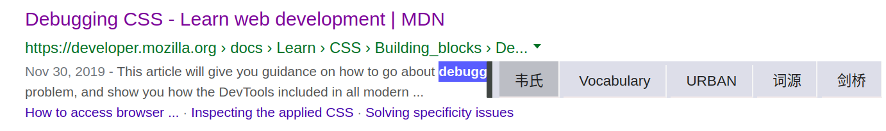

  

我开发这个插件的契机是，目前大多数英语阅读插件：
- 接入的是机器翻译接口，只让使用者快速获得对应中文，不方便学习英语。
- 接入了词典接口，但是只有一款词典，不能进行多款词典比对。
- 有不必要的功能，促使我写适合个人使用的最佳可用产品（Most Viable Product）。

本插件没有采用返回 JSON 的 API，而是利用各大词典网站的 URL 直接打开当前选中单词页面，方便使用者查证并学习英语。
此外，还增加了以下特性：
- 页面进度
- 暂时绕开个别英文媒体网站付费墙

通过开发该插件，我学到了：
- 谷歌插件的项目结构以及相关文件的结构及作用。
- 与本项目相关 JavaScript API 的内容
- 与本项目相关 Chrome API 的内容。

你可以从[此处](http://)查看项目。

