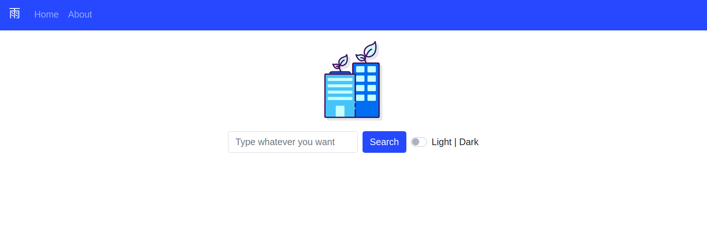

Urban Dictionary 官方网站方便我们学习英语俚语，但是网站目前尚未提供词条排序的功能。

因此我开发了这个基于 VUE 的网页应用，该应用利用 API 获取数据，使用 Vuex 来状态管理，并通过 Underscore.js 来实现词条排序，通过 Bootstrap 来润色交互界面。

此外本项目还有以下特性：
- 词条查询自动补全
- dark mode
- 按时间或点赞书排序
- 高亮词条

你可以从[此处]("https://github.com/fish-inu/urbandict")查看项目。
